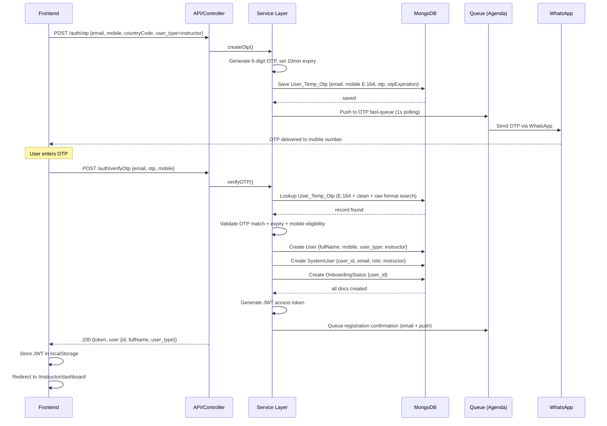

# I-01 — Instructor Sign Up (Mobile OTP)

**Role:** Instructor  
**Category:** Auth  
**Trigger:** New instructor registers with mobile number  
**API:** `POST /auth/otp` → `POST /auth/verifyOtp`

---

## Step-by-Step Flow

**FRONTEND:**
- Step 1 — Registration screen: enter full name, email, mobile, country code, user_type=instructor
- Step 2 — `POST /auth/otp { email, mobile, countryCode, user_type: 'instructor' }`

**BACKEND:**
- Step 3 — `[API]` auth.controller.js → `createOtp()`
- Step 4 — `[SVC]` Generate 6-digit OTP, set expiry (10 min)
- Step 5 — `[DB]` Save to `User_Temp_Otp { email, mobile (E.164), otp, otpExpiration, role }`
- Step 6 — `[Q]` Push to ultra-fast OTP queue (Agenda, 1-second polling)
- Step 7 — `[EXT]` WhatsApp provider sends OTP to instructor mobile

**FRONTEND:**
- Step 8 — OTP entry screen → enter 6 digits
- Step 9 — `POST /auth/verifyOtp { email, otp, mobile }`

**BACKEND:**
- Step 10 — `[API]` auth.controller.js → `verifyOTP()`
- Step 11 — `[SVC]` Look up `User_Temp_Otp` (multi-format search: E.164 + clean + raw)
- Step 12 — `[SVC]` Check OTP match + expiry; check mobile eligibility
- Step 13 — `[DB]` Create `User { fullName, mobile, user_type: 'instructor', status: 'Active' }`
- Step 14 — `[DB]` Create `SystemUser { user_id, email, role: 'instructor' }`
- Step 15 — `[DB]` Create `OnboardingStatus { user_id }` — track setup progress
- Step 16 — `[SVC]` Generate JWT access token
- Step 17 — `[Q]` Send registration confirmation (email + push)

**RETURN TO FRONTEND:**
- Step 18 — `200 { token, user { id, fullName, user_type } }`
- Step 19 — Store JWT in localStorage / SecureStore
- Step 20 — Redirect → `/instructor/dashboard` (shows onboarding checklist)

---

## Mermaid Diagram

