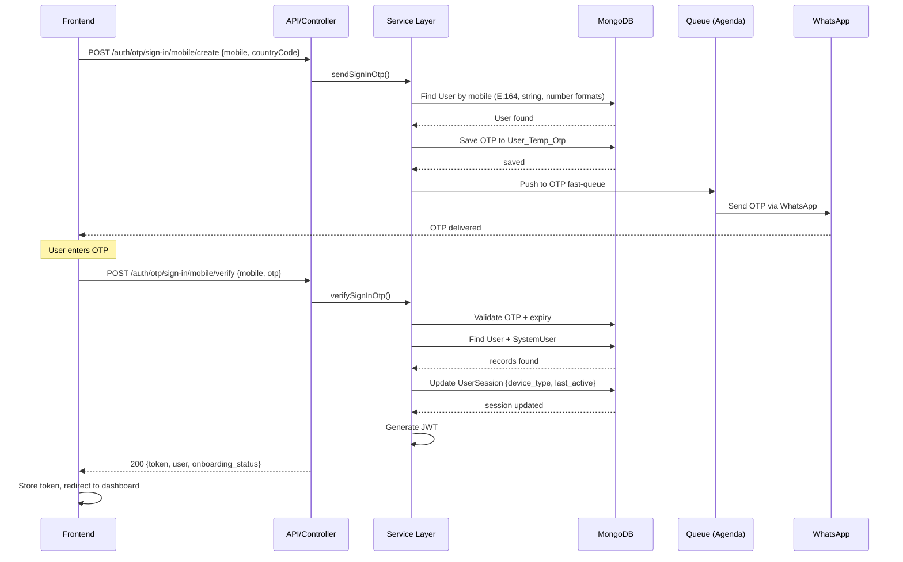

# I-02 — Instructor Sign In (Mobile OTP)

**Role:** Instructor  
**Category:** Auth  
**Trigger:** Existing instructor signs in with mobile OTP  
**API:** `POST /auth/otp/sign-in/mobile/create` → `POST /auth/otp/sign-in/mobile/verify`

---

## Step-by-Step Flow

**FRONTEND:**
- Step 1 — Login screen: enter registered mobile number
- Step 2 — `POST /auth/otp/sign-in/mobile/create { mobile, countryCode }`

**BACKEND:**
- Step 3 — `[API]` auth.controller.js → `sendSignInOtp()`
- Step 4 — `[DB]` Find User by mobile (multi-format: E.164, string, number)
- Step 5 — `[SVC]` Generate OTP; save to `User_Temp_Otp`
- Step 6 — `[Q]` OTP fast-queue → WhatsApp delivery

**FRONTEND:**
- Step 7 — Enter OTP → `POST /auth/otp/sign-in/mobile/verify { mobile, otp }`

**BACKEND:**
- Step 8 — `[API]` auth.controller.js → `verifySignInOtp()`
- Step 9 — `[DB]` Validate OTP + expiry; find User + SystemUser
- Step 10 — `[DB]` Update `UserSession { user_id, device_type, last_active }`
- Step 11 — `[SVC]` Generate JWT

**RETURN TO FRONTEND:**
- Step 12 — `200 { token, user, onboarding_status }`
- Step 13 — Store token → redirect to instructor dashboard

---

## Mermaid Diagram

