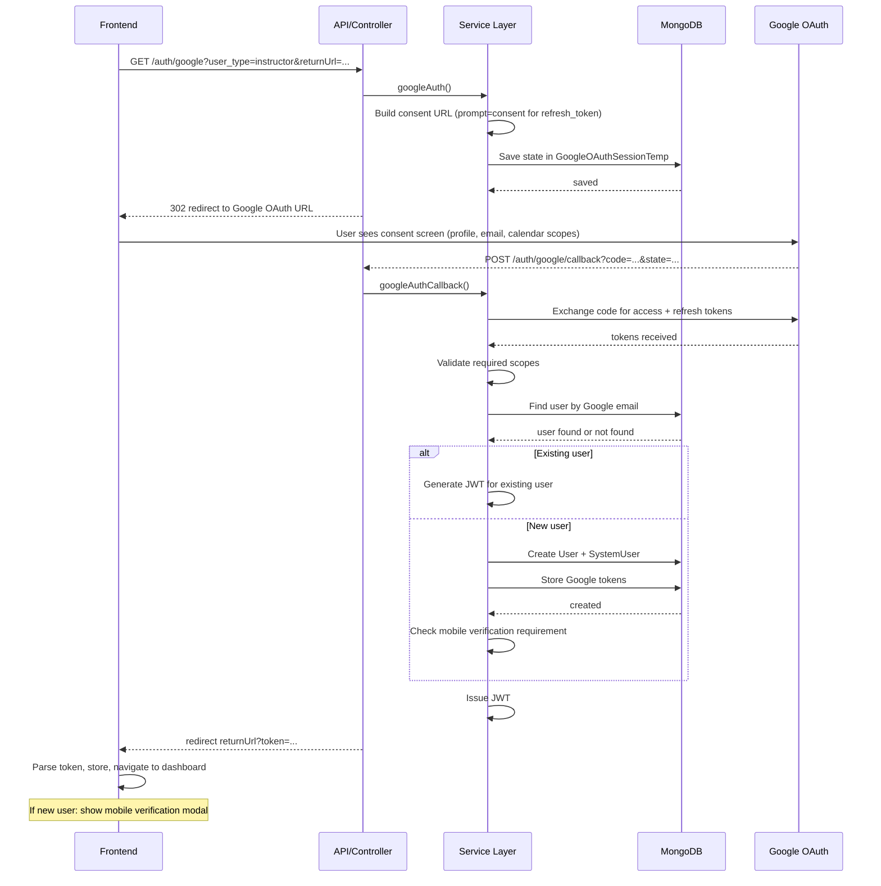

# I-03 — Instructor Sign In / Sign Up (Google OAuth — Web)

**Role:** Instructor  
**Category:** Auth  
**Trigger:** Instructor clicks "Sign in with Google"  
**API:** `GET /auth/google` → Google OAuth → `POST /auth/google/callback`

---

## Step-by-Step Flow

**FRONTEND:**
- Step 1 — Click "Sign in with Google"
- Step 2 — `GET /auth/google?user_type=instructor&returnUrl=...`

**BACKEND:**
- Step 3 — `[API]` auth.controller.js → `googleAuth()`
- Step 4 — `[SVC]` Build Google OAuth consent URL (always `prompt=consent` to get refresh_token)
- Step 5 — `[DB]` Save OAuth state in `GoogleOAuthSessionTemp`
- Step 6 — `[API]` → 302 redirect to Google OAuth URL

**EXTERNAL (Google):**
- Step 7 — `[EXT]` Google shows consent screen (scopes: profile, email, calendar)
- Step 8 — `[EXT]` Google redirects → `POST /auth/google/callback?code=...&state=...`

**BACKEND:**
- Step 9 — `[API]` auth.controller.js → `googleAuthCallback()`
- Step 10 — `[SVC]` Exchange authorization code for access + refresh tokens via OAuth2Client
- Step 11 — `[SVC]` Validate required scopes (profile + email + calendar)
- Step 12 — `[DB]` Find user by Google email — existing user → login; not found → new user
- Step 13 — `[SVC]` If new user: check if mobile verification needed
- Step 14 — `[DB]` If new: create User + SystemUser; store Google tokens
- Step 15 — `[SVC]` Issue JWT

**RETURN TO FRONTEND:**
- Step 16 — Redirect to `returnUrl?token=...`
- Step 17 — Parse token from URL → store → navigate to dashboard
- Step 18 — If mobile needed: show mobile verification modal

---

## Mermaid Diagram

