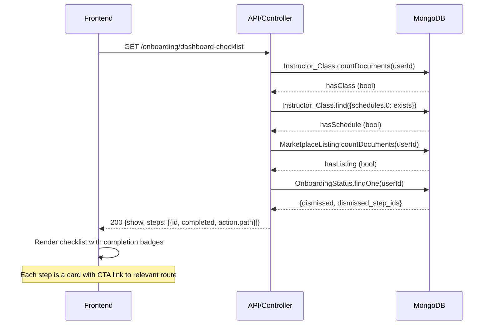

# I-04 — Instructor Onboarding (Post-Registration Setup)

**Role:** Instructor  
**Category:** Auth  
**Trigger:** Instructor loads dashboard after first registration  
**API:** `GET /onboarding/dashboard-checklist`

---

## Step-by-Step Flow

**FRONTEND:**
- Step 1 — Dashboard shows "Getting Started" checklist (3 steps)
- Step 2 — `GET /onboarding/dashboard-checklist`

**BACKEND:**
- Step 3 — `[API]` `getDashboardChecklistForUser(userId)`
- Step 4 — `[DB]` Check: `has_instructor_class?` → `Instructor_Class.countDocuments`
- Step 5 — `[DB]` Check: `has_class_schedule?` → `Instructor_Class` with `schedules.0` exists
- Step 6 — `[DB]` Check: `has_marketplace_listing?` → `MarketplaceListing.countDocuments`
- Step 7 — `[DB]` Get `OnboardingStatus { dismissed, dismissed_step_ids }`

**RETURN TO FRONTEND:**
- Step 8 — `200 { show: true, steps: [ { id, completed, action.path } ] }`
- Step 9 — Renders checklist; each step links to the correct dashboard route

---

## Checklist Steps

| Step | Condition | Links to |
|------|-----------|----------|
| Create your first class | `has_instructor_class = true` | `/instructor/classes/new` |
| Add a schedule | `has_class_schedule = true` | `/instructor/classes` |
| List on marketplace | `has_marketplace_listing = true` | `/instructor/marketplace/new` |

---

## Mermaid Diagram

