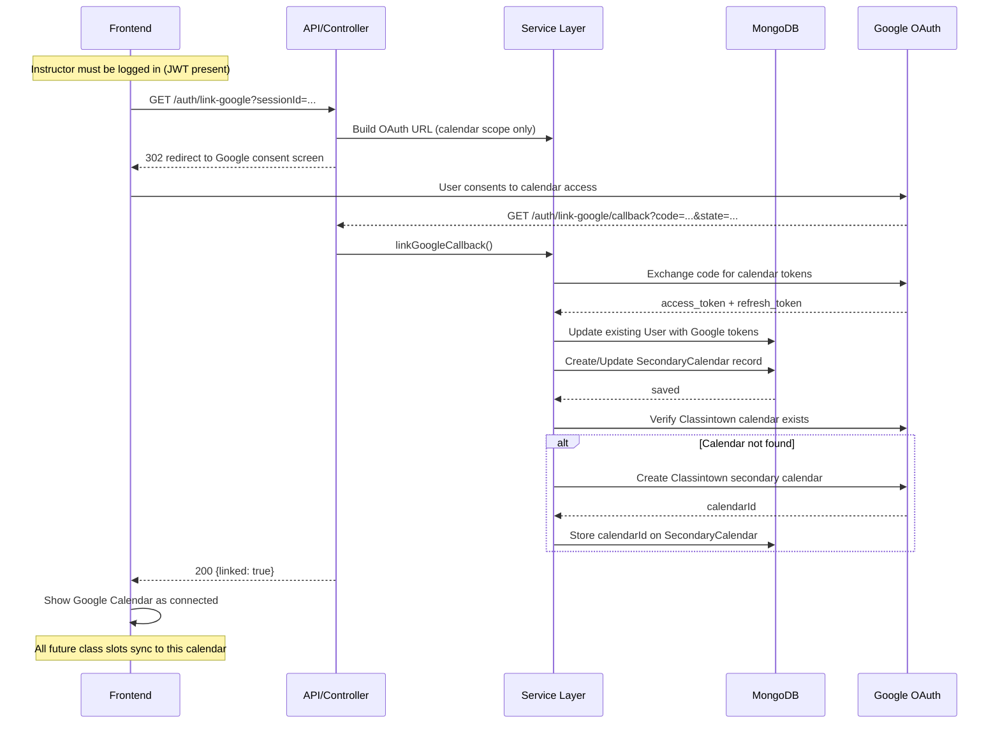

# I-28 — Connect Google Calendar (Link to Existing Account)

**Role:** Instructor  
**Category:** Auth  
**Trigger:** Instructor connects their Google Calendar from Settings  
**API:** `GET /auth/link-google?sessionId=...` → Google OAuth → callback

---

## Step-by-Step Flow

**FRONTEND:**
- Step 1 — Settings → Integrations → Connect Google Calendar
- Step 2 — `GET /auth/link-google?sessionId=...` (JWT required — different from sign-in flow)

**BACKEND:**
- Step 3 — `[API]` googleLinking.controller.js → `linkGoogleCallback()`
- Step 4 — `[EXT]` Google OAuth — calendar scope only (does NOT create a new account)
- Step 5 — `[DB]` Store Google tokens on **existing** user (update, not create)
- Step 6 — `[DB]` Create/update `SecondaryCalendar` record for this instructor
- Step 7 — `[SVC]` Verify secondary calendar exists or create "Classintown" calendar in Google Calendar

**RETURN TO FRONTEND:**
- Step 8 — `200 { linked: true }`
- Step 9 — Google Calendar shows as connected; all future class events sync to instructor's calendar

---

## Key Distinction vs I-03

| I-03 (Sign In with Google) | I-28 (Link Google Calendar) |
|---|---|
| Creates or logs in user | Links to EXISTING user |
| Scopes: profile + email + calendar | Scope: calendar only |
| Generates JWT | No new token — user already logged in |
| `GoogleOAuthSessionTemp` for state | `sessionId` query param for state |

---

## Mermaid Diagram

